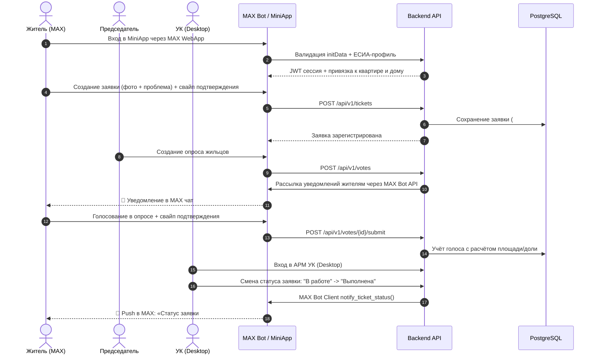

# 🏠 Мой Дом — Единая цифровая среда управления МКД

[](https://www.python.org/)
[](https://fastapi.tiangolo.com/)
[](https://react.dev/)
[](https://www.typescriptlang.org/)
[](https://www.postgresql.org/)
[](https://www.docker.com/)

> **Единая цифровая среда управления многоквартирными домами внутри национального мессенджера MAX.**  
> MiniApp объединяет жителей, председателей советов домов и управляющие организации в едином доверенном контуре: проверенные новости, прозрачный реестр обращений с подтверждением соседей и предварительный сбор мнений по общедомовым инициативам.

- 🤖 **MiniApp в MAX Messenger:** [@t739_hakaton_max_bot](https://max.ru/t739_hakaton_max_bot)
- 📦 **Git-репозиторий:** [ya-prgm/smart-housing-max](https://github.com/ya-prgm/smart-housing-max.git)
- 📌 **Commit Hash:** `44731e28ffc338a98bfbc42bc88ce6ca66a6a200`

---

## 📑 Оглавление

1. [Назначение решения](#1-назначение-решения)
2. [Основной пользовательский сценарий](#2-основной-пользовательский-сценарий)
3. [Функционал по ролям](#3-функционал-по-ролям)
4. [Состав и архитектура решения](#4-состав-и-архитектура-решения)
5. [Технологический стек](#5-технологический-стек)
6. [Быстрый запуск в Docker](#6-быстрый-запуск-в-docker)
7. [Параметры и переменные окружения](#7-параметры-и-переменные-окружения)
8. [Используемые сетевые порты](#8-используемые-сетевые-порты)
9. [Зависимости проекта](#9-зависимости-проекта)
10. [Внешние сервисы и интеграции](#10-внешние-сервисы-и-интеграции)
11. [Описание работы с данными](#11-описание-работы-с-данными)
12. [Порядок работы с тестовыми данными](#12-порядок-работы-с-тестовыми-данными)
13. [Пошаговый сценарий проверки](#13-пошаговый-сценарий-проверки)
14. [Примеры ожидаемого поведения системы](#14-примеры-ожидаемого-поведения-системы)
15. [Структура проекта](#15-структура-проекта)
16. [Известные ограничения](#16-известные-ограничения)
17. [Остановка и повторный запуск](#17-остановка-и-повторный-запуск)

---

## 1. Назначение решения

«Мой Дом» решает ключевые барьеры во взаимодействии жильцов и управляющих организаций:
1. **Проверенные новости дома:** единый официальный канал без спама и дезинформации со стороны УК и председателя совета МКД.
2. **Прозрачный реестр обращений:** подача заявок по официальному классификатору проблем ЖКХ с фиксацией фото/документов, контролем сроков и механизмом поддержки проблемы соседями **«У меня тоже»** (для приоритезации общедомовых аварий).
3. **Предварительный сбор мнений:** легитимные опросы и голосования с защитой от накруток, расчётом кворума и автоматическим формированием протоколов решений до выхода на ОСС.

---

## 2. Основной пользовательский сценарий



---

## 3. Функционал по ролям

### 👤 Житель (Мобильный MiniApp)
- **Лента дома:** просмотр официальных публикаций УК и председателя, реакции, комментарии к новостям.
- **Обращения в УК и службы:** создание заявок с классификатором (протечки, отопление, лифты, освещение, благоустройство), прикрепление фото, подтверждение свайп-слайдером.
- **«У меня тоже»:** подтверждение аналогичной проблемы соседями в один клик, объединяющее обращения в коллективный статус повышенного приоритета.
- **Опросы и голосования:** участие в опросах дома с вариантами ответов (одиночный, множественный, текстовый) и подтверждением голоса слайдером.
- **Мой дом и лицевой счёт:** информация о доме, этажности, управляющей компании, контактах аварийных служб, балансе ЖКУ.
- **Push-уведомления через MAX Bot:** мгновенные оповещения в личный чат мессенджера об изменении статуса обращения, ответах диспетчера и новых опросах.
- **Быстрый доступ по PIN-коду:** 4-значный PIN для мгновенного входа без повторного ввода пароля Госуслуг при повторном открытии.

### 🎖️ Председатель совета МКД (MiniApp с расширенными правами)
- **Публикация в ленту:** создание официальных объявлений, отчётов о проделанной работе, прикрепление фотоотчётов.
- **Конструктор опросов:** создание опросов собственников с настройкой дедлайна, одиночного/множественного выбора или свободного ответа.
- **Аналитика дома:** мониторинг динамики активности жителей, явки на голосования и открытых проблем в подъездах.

### 🏢 Управляющая организация / УК (Desktop Web-кабинет)
- **Управление жилым фондом:** реестр многоквартирных домов, технических паспортов, конструктивных элементов и характеристик износа.
- **Диспетчерская обращений:** фильтрация по домам, статусам, приоритетам; назначение исполнителей; смена статусов с комментариями; чат по заявке.
- **Общедомовые голосования:** запуск опросов по домам, контроль кворума по жилой площади, выгрузка протоколов.
- **Реестр жителей и квартир:** поквартирная картотека, управление ролями (назначение Председателя), синхронизация с ЕСИА.
- **Электронный архив документов:** договоры управления, акты сезонных осмотров, отчёты, протоколы общих собраний.
- **Журнал событий (Аудит):** сквозной аудит действий сотрудников УК и председателей для обеспечения юридической чистоты.

---

## 4. Состав и архитектура решения

```text
+-----------------------------------------------------------------------------------+
|                                 КЛИЕНТСКИЙ УРОВЕНЬ                                 |
|                                                                                   |
|  +----------------------------------+     +------------------------------------+  |
|  |     MAX Messenger (Мобильный)    |     |      Браузер ПК / Планшет          |  |
|  |   +---------------------------+  |     |   +-----------------------------+  |  |
|  |   |   MiniApp (React 18 SPA)  |  |     |   |    АРМ УК (Desktop Web)     |  |  |
|  |   |   Tailwind CSS / Zustand  |  |     |   |   Tailwind CSS / TanStack   |  |  |
|  |   +---------------------------+  |     |   +-----------------------------+  |  |
|  +-----------------+----------------+     +------------------+-----------------+  |
+--------------------|-----------------------------------------|--------------------+
                     | HTTP / REST (JWT Auth, initData)        |
                     +--------------------+--------------------+
                                          |
+-----------------------------------------v-----------------------------------------+
|                                БЭКЕНД И API СЕРВИСЫ                                |
|                                                                                   |
|  +-----------------------------------------------------------------------------+  |
|  |                       FastAPI Application (Python 3.10+)                    |  |
|  |  - Auth & Security: MAX initData Hash Check (HMAC-SHA256) + JWT + PIN Bcrypt|  |
|  |  - REST API Routers: /tickets, /votes, /feed, /users, /notifications, /uk    |  |
|  |  - Business Services: TicketService, FeedService, VoteService, EsiaService  |  |
|  |  - Data Layer: SQLAlchemy 2.0 (Asyncpg), Connection Pool, Repositories      |  |
|  +-----------------------+-----------------------------+-----------------------+  |
|                          |                             |                          |
|         +----------------v---------------+             |                          |
|         |    MAX Bot Long Polling / API   |             |                          |
|         |    (Команды, Push-уведомления) |             |                          |
|         +----------------+---------------+             |                          |
+--------------------------|-----------------------------|--------------------------+
                           |                             |
+--------------------------|-----------------------------|--------------------------+
|      ВНЕШНИЕ ИНТЕГРАЦИИ  |                             |   ХРАНИЛИЩЕ ДАННЫХ       |
|                          |                             |                          |
|  +-----------------------v-------+      +--------------v-----------------------+  |
|  |      MAX Bot Webhook API      |      |         PostgreSQL 16 Engine         |  |
|  |   https://platform-api2.max.ru|      |  - Пользователи, Квартиры, МКД        |  |
|  +-------------------------------+      |  - Заявки, Опросы, Голоса, Лента     |  |
|                                         |  - Аудит-лог, In-App Уведомления     |  |
|  +-------------------------------+      +--------------+-----------------------+  |
|  |       ЕСИА / Госуслуги        |                     |                          |
|  |   (Имитационный шлюз СМЭВ)    |      +--------------v-----------------------+  |
|  +-------------------------------+      |         Local File Storage           |  |
|                                         |   (/app/data/uploads, фото заявок)   |  |
|                                         +--------------------------------------+  |
+-----------------------------------------------------------------------------------+
```

### Компоненты системы
1. **Frontend (MiniApp & АРМ УК):** единое SPA-приложение на React 18, адаптированное под стандарты MAX WebApp на мобильных устройствах и полноценное десктопное рабочее место диспетчера УК.
2. **Backend API (FastAPI):** асинхронный REST API-сервер, реализующий бизнес-логику, разграничение прав доступа (RBAC), обработку файлов и транзакционную работу с БД.
3. **MAX Bot Integration Service:** фоновый сервис для привязки пользователей мессенджера к учетным записям, интерактивного запуска MiniApp и доставки push-сообщений.
4. **PostgreSQL 16:** реляционная СУБД с поддержкой схемы МКД, очередей уведомлений и журнала аудита.
5. **Local File Storage:** том для безопасного хранения фотоматериалов обращений и вложений новостной ленты.

---

## 5. Технологический стек

| Область | Технологии |
|---|---|
| **Backend** | Python 3.10+, FastAPI, SQLAlchemy 2.0 (Async), asyncpg, Pydantic 2.7, Alembic, Uvicorn, httpx |
| **Frontend** | React 18, TypeScript 5, Vite 5, Tailwind CSS 3.4, Lucide React, Zustand, TanStack Query, React Router 6 |
| **База данных** | PostgreSQL 16 (Alpine), расширение `unaccent` |
| **Инфраструктура** | Docker, Docker Compose, Multi-stage builds, Nginx (frontend reverse-proxy) |
| **Безопасность** | Валидация MAX initData (HMAC-SHA256), JWT (Access 15 мин, Refresh 30 дней), Bcrypt PIN-код, SecureStorage |

---

## 6. Быстрый запуск в Docker

### Предварительные требования
- Установленный **Docker Engine** (версия 24.0+)
- Установленный **Docker Compose v2** (команда `docker compose`)
- Утилита **Git**

### Запуск одной командой

```bash
# 1. Клонирование репозитория
git clone https://github.com/ya-prgm/smart-housing-max.git
cd smart-housing-max

# 2. Подготовка файла окружения (при необходимости отредактируйте MAX_BOT_TOKEN)
cp .env.example .env

# 3. Сборка и запуск всех сервисов одной командой
docker compose up --build -d
```

> [!TIP]
> При первом запуске бэкенд автоматически инициализирует структуру базы данных и выполняет сидирование демонстрационных домов, жителей, заявок и опросов.

---

## 7. Параметры и переменные окружения

Конфигурация проекта задаётся в файле `.env` в корне репозитория:

| Переменная | Описание | Пример значения | Обязательна |
|---|---|---|---|
| `ENVIRONMENT` | Окружение запуска (`production`, `development`) | `production` | Да |
| `DOMAIN` | Домен для публикации приложения | `obsuzhdalych.ru` | Да |
| `APP_URL` | Полный URL веб-приложения | `https://obsuzhdalych.ru` | Да |
| `HTTP_PORT` | Внешний порт фронтенда | `3000` | Да |
| `BACKEND_PORT` | Внешний порт API | `8000` | Да |
| `SECRET_KEY` | Секретный ключ для подписи JWT | `your_secret_jwt_key_here` | Да |
| `ALGORITHM` | Алгоритм подписи токенов | `HS256` | Да |
| `ACCESS_TOKEN_EXPIRE_MINUTES` | Время жизни access-токена (в минутах) | `15` | Да |
| `REFRESH_TOKEN_EXPIRE_DAYS` | Время жизни refresh-токена (в днях) | `30` | Да |
| `MAX_BOT_TOKEN` | Токен авторизации бота в платформе MAX | `123456:AAFlk...` | Для бота |
| `MAX_BOT_API_URL` | Базовый URL API платформы MAX | `https://platform-api2.max.ru` | Да |
| `MAX_BOT_NAME` | Имя бота в мессенджере MAX | `t739_hakaton_max_bot` | Да |
| `POSTGRES_DB` | Имя базы данных PostgreSQL | `my_home_database` | Да |
| `POSTGRES_USER` | Пользователь PostgreSQL | `postgres` | Да |
| `POSTGRES_PASSWORD` | Пароль пользователя PostgreSQL | `44558833` | Да |
| `DATABASE_URL` | Async-строка подключения SQLAlchemy | `postgresql+asyncpg://postgres:pass@db:5432/my_home` | Да |
| `VITE_API_URL` | Базовый префикс API для фронтенда | `/api/v1` | Да |

> [!WARNING]
> Никогда не коммитьте боевые токены и пароли в публичный репозиторий. В файле `.env.example` представлены безопасные демонстрационные плейсхолдеры.

---

## 8. Используемые сетевые порты

| Сервис | Контейнер | Внутренний порт | Внешний порт | Назначение / URL |
|---|---|---|---|---|
| **Frontend** | `max_frontend` | 80 | **3000** | Веб-интерфейс MiniApp и АРМ УК: `http://localhost:3000` |
| **Backend** | `max_backend` | 8000 | **8000** | REST API: `http://localhost:8000/api/v1` |
| **Swagger UI** | `max_backend` | 8000 | **8000** | Интерактивная документация: `http://localhost:8000/api/docs` |
| **PostgreSQL**| `max_postgres` | 5432 | **5432** | Прямой доступ к СУБД (при локальной отладке) |

---

## 9. Зависимости проекта

- **Backend:** зафиксированы в [`backend/requirements.txt`](backend/requirements.txt) (FastAPI, uvicorn, sqlalchemy, asyncpg, alembic, pydantic, python-jose, passlib, bcrypt, httpx, watchfiles).
- **Frontend:** зафиксированы в [`frontend/package.json`](frontend/package.json) и [`frontend/package-lock.json`](frontend/package-lock.json) (React, React Router, TanStack Query, Zustand, Tailwind CSS, Lucide React).
- **Docker контейнеризация:** [`backend/Dockerfile`](backend/Dockerfile), [`frontend/Dockerfile`](frontend/Dockerfile), [`compose.yaml`](compose.yaml).

---

## 10. Внешние сервисы и интеграции

1. **MAX Messenger Platform API (`https://platform-api2.max.ru`):**
   - Интеграция с ботом по HTTP API через токен бота.
   - Механизм Long Polling обновлений для обработки команд `/start`, `/help`, `/app`.
   - Отправка персональных сообщений и сервисных уведомлений с интерактивными кнопками быстрого перехода в MiniApp.
   - Криптографическая валидация `initData` по алгоритму HMAC-SHA256 для сквозной беспарольной аутентификации пользователя в мессенджере.
2. **ЕСИА / Госуслуги (СМЭВ Mock-шлюз):**
   - Моделирование аутентификации граждан РФ с верификацией СНИЛС, подтверждением прав собственности на жилые помещения и автоматической привязкой к лицевым счетам.
3. **Локальное файловое хранилище:**
   - Хранение загруженных пользователями фотографий к обращениям и новостным публикациям с выдачей через защищённый endpoint бэкенда `/api/v1/files/{id}`.

---

## 11. Описание работы с данными

База данных построена по нормализованной реляционной модели в СУБД PostgreSQL 16:
- `users`: учётные записи жителей, председателей и сотрудников УК с привязкой к `max_user_id` и ЕСИА СНИЛС.
- `user_pins`: хешированные bcrypt 4-значные PIN-коды для быстрого доступа в MiniApp.
- `houses`: паспорта МКД (адрес, проектная серия, износ, площадь, этажность, реквизиты УК).
- `apartments`: реестр квартир с площадями, долями и статусом задолженностей ЖКУ.
- `user_apartments`: матрица прав собственности («Собственник», «Член семьи», «Арендатор») и признак подтверждения через Госуслуги.
- `tickets`: реестр заявок с кодами (#4812), классификатором тем, приоритетами, исполнителями и статусами (`active`, `in_progress`, `completed`, `rejected`).
- `ticket_supports`: фиксация голосов жильцов «У меня тоже» по уникальной связке `(ticket_id, user_id)`.
- `polls`, `poll_questions`, `poll_options`, `poll_responses`: архитектура многовариантных опросов с фиксацией голосов и расчётом кворума.
- `feed_posts`, `feed_post_comments`, `feed_post_reactions`: новостная лента дома с лайками/дизлайками и обсуждениями.
- `notifications`: история уведомлений пользователей с признаками прочтения и ссылками для перехода.
- `audit_logs`: журнал действий операторов УК (смена статусов, редактирование ролей, удаление записей).

---

## 12. Порядок работы с тестовыми данными

В репозитории предусмотрен скрипт автоматического наполнения базы данных [`backend/app/scripts/seed.py`](backend/app/scripts/seed.py).  
При старте он автоматически разворачивает тестовый жилой фонд (Казань, ул. Баумана, 12 и др.), поставщиков ресурсов, жильцов, председателя, заявки и опросы.

### Тестовые учётные записи (ЕСИА Mock)

| Роль | Логин (СНИЛС) | Пароль | Предустановленный PIN | Привязанный объект |
|---|---|---|---|---|
| **Житель** | `123-456-789 01` | `demo_password` | `1234` | ул. Баумана, д. 12, кв. 48 |
| **Председатель** | `987-654-321 00` | `demo_password` | `1234` | ул. Баумана, д. 12, кв. 48 (Совет МКД) |
| **УК (Диспетчер)** | `111-222-333 44` | `demo_password` | `1234` | ООО УК «ЖилКомФорт» (Все дома) |

---

## 13. Пошаговый сценарий проверки

> [!NOTE]
> Проверку можно выполнять как в живом мессенджере MAX через бота [@t739_hakaton_max_bot](https://max.ru/t739_hakaton_max_bot), так и в любом браузере по адресу `http://localhost:3000`.

### Шаг 1. Вход под ролью «Житель»
1. Откройте приложение в MAX или перейдите на `http://localhost:3000`.
2. Выберите вход через **Госуслуги (ЕСИА)**, введите логин `123-456-789 01` и пароль `demo_password`.
3. Задайте или подтвердите PIN-код (`1234`).
4. Откроется главный экран жителя с адресом `ул. Баумана, д. 12`.

### Шаг 2. Создание обращения с подтверждением слайдером
1. Перейдите на вкладку **«Заявки»** ➔ нажмите **«Новая заявка»**.
2. Выберите категорию (например, *«Водоснабжение»* ➔ *«Капает стояк»*), введите описание и прикрепите фото.
3. Проведите пальцем/мышью слайдер **«Проведите для отправки»**.
4. Заявка зарегистрирована со статусом **«Новая»**.

### Шаг 3. Поддержка проблемы соседа «У меня тоже»
1. В списке заявок переключитесь на вкладку **«Все заявки дома»**.
2. Найдите обращение соседа (например, *«Не работает свет на этаже»*) и нажмите кнопку **«У меня тоже»**.
3. Счётчик проблемы увеличится, заявка поднимется в приоритете диспетчера.

### Шаг 4. Участие в голосовании
1. Откройте вкладку **«Голосования»**.
2. Выберите активный опрос (например, *«Установка шлагбаума во дворе»*).
3. Выберите вариант ответа и подтвердите отправку свайпом по слайдеру.
4. Результат мгновенно отобразится в графике распределения голосов.

### Шаг 5. Вход под ролью «Председатель» и публикация новости
1. В профиле переключите учётную запись через ЕСИА на `987-654-321 00` / `demo_password`.
2. На главной странице станет доступна кнопка **«Создать публикацию»**.
3. Введите тему, текст отчёта, прикрепите фото и подтвердите публикацию слайдером.
4. Пост появится в общедомовой ленте; бот отправит подтверждение автору.

### Шаг 6. Создание нового опроса председателем
1. Перейдите во вкладку голосований ➔ **«Создать опрос»**.
2. Заполните тему, описание, варианты ответов, укажите срок окончания.
3. Подтвердите создание слайдером. Опрос станет доступен всем соседям.

### Шаг 7. Обработка обращения в АРМ УК (Desktop)
1. Откройте приложение с компьютера под аккаунтом УК (`111-222-333 44` / `demo_password`).
2. В боковом меню откройте **«Обращения»** ➔ выберите созданную на Шаге 2 заявку.
3. Нажмите **«Изменить статус»** ➔ переведите в **«В работе»**, а затем в **«Выполнена»**, добавив комментарий мастера.

---

## 14. Примеры ожидаемого поведения системы

- **Подтверждение свайпом (Swipe-to-Confirm):** защищает от случайных нажатий при подаче юридически значимых заявок и фиксации голосов на ОСС. При завершении жеста раздаётся тактильный отклик и элемент блокируется от повторной отправки.
- **Push-уведомления в MAX:** при изменении диспетчером статуса заявки жителю в чат с ботом MAX немедленно поступает сообщение вида:
  > ⚙️ **Статус заявки обновлен**  
  > Заявка: **#4812**  
  > Тема: **Капает стояк ГВС на кухне**  
  > Новый статус: **В работе**  
  > 💬 *Комментарий УК: Слесарь выехал на объект, ориентировочное время прибытия 14:30.*  
  > `[📄 Открыть заявку]`
- **Общедомовая лента:** публикации председателя получают статусную плашку «Председатель», объявления управляющей компании — значок «УК». Жители могут ставить реакции и обсуждать новость в комментариях.
- **Кворум в опросах:** система подсчитывает процент участия жителей не только по количеству человек, но и с учётом жилой площади квартир собственников.

---

## 15. Структура проекта

```text
smart-housing-max/
├── compose.yaml                # Docker Compose конфигурация сервисов
├── docker-compose.yml          # Алиас Docker Compose
├── .env.example                # Шаблон переменных окружения
├── .dockerignore               # Исключения для сборки контейнеров
│
├── backend/                    # Серверный компонент (FastAPI)
│   ├── Dockerfile              # Multi-stage сборка backend-образа
│   ├── requirements.txt        # Python-зависимости
│   ├── pytest.ini              # Конфигурация тестового фреймворка
│   ├── alembic/                # Миграции структуры базы данных
│   ├── tests/                  # Набор из 56 автоматизированных тестов
│   └── app/
│       ├── main.py             # Точка входа ASGI, CORS, статика, lifecycle
│       ├── api/                # Маршрутизаторы REST API
│       │   ├── deps.py         # Инъекция зависимостей (JWT, DB, Role-check)
│       │   └── v1/             # Эндпоинты версии v1
│       │       ├── auth.py     # MAX initData, ЕСИА Mock, PIN-код
│       │       ├── feed.py     # Лента дома, реакции, комментарии
│       │       ├── tickets.py  # Заявки жителей, кнопка «У меня тоже»
│       │       ├── votes.py    # Опросы жителей и председателя
│       │       ├── users.py    # Профиль, дом, услуги, счета
│       │       ├── files.py    # Загрузка и выдача изображений
│       │       └── uk/         # Модули АРМ УК (дома, журнал, жители, акты)
│       ├── bot/                # Интеграция с платформой мессенджера MAX
│       │   ├── client.py       # Клиент API платформы MAX (отправка сообщений)
│       │   ├── polling.py      # Фоновый процесс Long Polling
│       │   ├── handlers.py     # Обработка /start, /help, /app
│       │   └── notifications.py# Диспетчер push-уведомлений о событиях
│       ├── core/               # Конфигурация, СУБД, безопасность
│       ├── models/             # SQLAlchemy ORM-модели сущностей
│       ├── repositories/       # Слой прямого доступа к данным
│       ├── schemas/            # Валидационные схемы Pydantic
│       ├── scripts/            # Инициализация и сидирование (seed.py)
│       ├── services/           # Бизнес-логика предметных областей
│       └── utils/              # Кроссплатформенные форматтеры и утилиты
│
├── frontend/                   # Клиентский компонент (React 18 + Vite)
│   ├── Dockerfile              # Multi-stage сборка с Nginx
│   ├── package.json            # Зависимости и скрипты Node.js
│   ├── vite.config.ts          # Конфигурация сборщика Vite
│   ├── tailwind.config.js      # Темизация и дизайн-система Tailwind
│   └── src/
│       ├── app/                # Корневой роутер, провайдеры, стили
│       ├── features/           # Функциональные модули
│       │   ├── auth/           # Авторизация через ЕСИА, экран PIN-кода
│       │   ├── mobile/         # Экраны мобильного MiniApp (лента, заявки, опросы)
│       │   ├── chairman/       # Кабинет председателя (создание постов/опросов)
│       │   └── uk/             # АРМ Управляющей компании (десктопные реестры)
│       └── shared/             # Переиспользуемые компоненты, API-клиент, сторы
│
└── docs/                       # Документация архитектуры и API-спецификации
```

---

## 16. Известные ограничения

1. **Имитация ЕСИА:** авторизация через Госуслуги является демонстрационной моделью (mock). Подключение к промышленному СМЭВ ЕСИА требует аккредитации оператора персональных данных в Минцифры РФ.
2. **Интеграция с ГИС ЖКХ:** импорт начислений и выгрузка протоколов ОСС смоделированы внутри базы данных приложения без прямого шлюза к федеральной ГИС ЖКХ.
3. **Биометрия:** быстрый повторный вход реализован через зашифрованный PIN-код и SecureStorage MAX без использования WebAuthn/FaceID.
4. **Синтетические данные:** адреса домов и характеристики жилого фонда являются тестовыми моделями, воспроизводящими реальную специфику МКД г. Казани.

---

## 17. Остановка и повторный запуск

```bash
# Остановка всех контейнеров с сохранением данных в томах:
docker compose down

# Остановка с полной очисткой данных (удаление БД и файлов):
docker compose down -v

# Повторный запуск проекта:
docker compose up -d

# Просмотр логов бэкенда и бота в реальном времени:
docker compose logs -f backend
```

---

<p align="center">
  <b>«Мой Дом»</b> — Цифровой комфорт каждого жителя в мессенджере MAX.<br>
  Разработано в рамках хакатона 2026.
</p>
